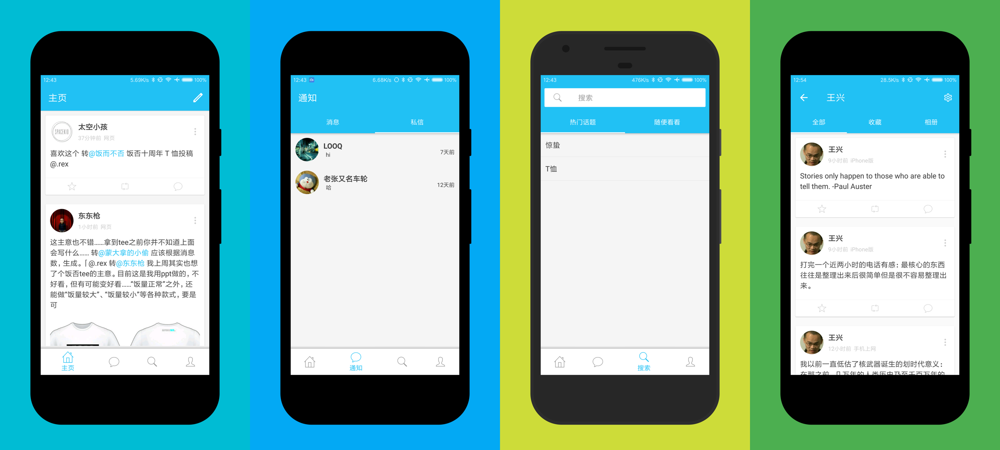

# 嘻饭
>一款基于Material Design设计与开发的饭否第三方Android客户端，简约、大方，用完即走。

# 预览

# 下载
[fir.im](http://fir.im/xifan)

# 致谢
感谢以下开源项目
* [retrofit](https://github.com/square/retrofit)
* [butterknife](https://github.com/JakeWharton/butterknife)
* [eventbus](https://github.com/greenrobot/EventBus)
* [glide](https://github.com/bumptech/glide)
* [logger](https://github.com/orhanobut/logger)
* [circleimageview](https://github.com/hdodenhof/CircleImageView)
* [easyrecyclerview](https://github.com/Jude95/EasyRecyclerView)
* [bottomnavigation](https://github.com/Ashok-Varma/BottomNavigation)

图标资源
* [icons8](https://icons8.com)

# 关于我
*	**QQ:** 421575839
*	**博客:** [http://www.chenlongfei.cn](http://www.chenlongfei.cn)